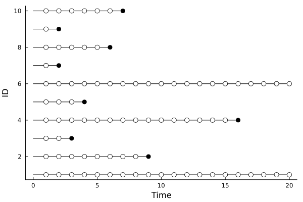

# Likelihood functions for time-to-event observations subject to left-truncation and right censoring

## Introduction:

Parametric survival models in `LSurvival` are parameterized as accelerated failure time models, where model parameters for associations between covariates and survival outcomes are interpreted as changes to the expected life span. The likelihood and parameterization are discussed briefly here to give some sense of the underlying interpretation of the approach, but this discussion is not intended to replace more thorough treatments in survival analysis texts.

## Definitions:

- Random variable $E$: time at beginning of observation
- Random variable $T$: time at end of observation
- Random variable $Y$: event indicator (1=yes, 0=no)
- Realization $e_i$: time at study entry for observation $i$
- Realization $t_i$: time at study end for observation $i$
- Realization $y_i$: event indicator (1=yes, 0=no) for observation $i$
- Realization $\mathbf{x}_i$: covariate vector for observation $i$
- Function $f(t)$: probability density function evaluated at $T=t$
- Function $S(t)=Pr(T>t)$: survival function evaluated at $T=t$, where $S(0)= 1$
- Function $\mathscr{L} \equiv\mathscr{L}(t,e,y;\theta)$: likelihood function for observed data under a parametric distribution with parameters $\theta$

## Likelihoods for survival data subject to right censoring and left truncation

We then have that the likelihood for i.i.d. data decomposes as
 
$$\begin{aligned}
\mathscr{L} =& \prod_i \mathscr{L}_i\\
\mathscr{L}_i =& \frac{f(t_i)^{y_i}S(t_i)^{(1-y_i)}}{S(e_i)}
\end{aligned}$$

With the log-likelihood ($\ln\mathscr{L}$) given as:

$$\begin{aligned}
\ln\mathscr{L} =& \ln\bigg(\prod_i \mathscr{L}_i\bigg)\\
   =& \sum_i \ln\mathscr{L}_i\\
\ln\mathscr{L}_i =& {y_i}\ln f(t_i) + (1-y_i)\ln S(t_i) - \ln S(e_i)
\end{aligned}$$

Meaning that the likelihood (and log-likelihood) under a survival model are calculable using the probability density function and the survival function (or natural log-transformations of those function outputs)

### Special case: person-period data
"Person period data" allows us to split data from an individual into multiple observations, so that an individual can be right-censored in their first observation and then left-truncated in their second observation at the same time. In this case, the likelihood contribution for individual $i$ ($E_i=e_i, T_i=t_i$, $y_i=1$) can be split over two person-periods ($j\in {1,2}$), where the first period starts at the entry time of the individual ($e_{i1} = e_i$) is right censored ($y_{i1}=0$) since we know the individual survives that period, and the second period includes late-entry immediately after the first period ($e_{i2}=t_{i1}$) and the failure time ($y_{i2}=1$, $t_{i2}=t_{i}$), since we know the individual experienced some time at risk before that period and failed within that period. This likelihood decomposition is given as:

$$\begin{aligned}
\mathscr{L}_i =& \prod_j \mathscr{L}_{ij}\\
 =& \prod_j\frac{f(t_{ij})^{y_{ij}}S(t_{ij})^{(1-y_{ij})}}{S(e_{ij})} \\
 =& \frac{f(t_{i1})^{y_{i1}}S(t_{i1})^{(1-y_{i1})}}{S(e_{i1})} \times \frac{f(t_{i2})^{y_{i2}}S(t_{i2})^{(1-y_{i2})}}{S(e_{i2})}  \\
 =& \frac{S(t_{i1})}{S(e_{ij}= e_i)} \times \frac{f(t_{i2}=t_i)^{y_{i2}=y_i}}{S(e_{i2}=t_{i1})} =  \frac{f(t_i)}{{S(e_i)}}
\end{aligned}$$

Which is exactly the likelihood we would observe if there were only one observation for this individual. Similar derivations can be made for censored individuals. This phenomena allows that, for example, covariates may differ across person-periods (time-varying covariates), and the general approach to likelihoods for left-truncated, right-censored survival data can readily accomodate this. The `LSurvival` module takes this general approach to defining the likelihood (and also the partial likelihood in Cox models) and so allows the estimation of effects of time-varying exposures as well as accomodating left truncation and right censoring. 

One example of person-period data is shown below. Each circle represents a censoring event, which can occur because an individual survives to the end-of-follow-up, is lost-to-follow-up (individual level) or because they have a person-period that they survive until the end of (period or record level). 

## Parametric likelihoods

Multiple parametric model forms are available in the `LSurvival` module. Here, we derive the specific parameterizations used in the module, which uses the location-scale characterization of regression models (also used in the `survival` package in `R`).

The distributions used here can be parameterized in several ways, and the parameterizations in `LSurvival` generally follow the "location-scale" parameterization. This parameterization allows that covariates are assumed to act in linear combinations on the natural log of the survival time, and a scale parameter (or parameters) influence the error distribution around that linear combination. In symbols, these models are of the form

$$\ln(t_i) = \mathbf{X_i\beta} + \epsilon_i$$

Where $\epsilon_i$ is an error term with a distribution determined by the assumed distribution of the survival times.

Traditional parameterizations (e.g. from the `Distributions` package) and their mapping to the location-scale parameterization are given below. Some distributions that are not yet implemented are included.

### Weibull distribution
Implemented as `LSurvival.Weibull()`

The Weibull distribution can be parameterized as: 
$$\begin{aligned} 
f(t|\lambda,\gamma)=&\lambda\gamma(\lambda t)^{\gamma-1}\exp(-(\lambda t)^{\gamma}) \\
S(t|\lambda,\gamma) =& \exp(-(\lambda t)^{\gamma})
\end{aligned}$$

This can be re-parameterized in terms of a 'location-scale' parameterization for modeling of the natural-log of the survival times. 

#### Derivation:

Let $\gamma = \exp(-\rho), \lambda = \exp(-\alpha), z=\frac{\ln(t)-\alpha}{exp(\rho)}$ and using $t=\exp(\ln(t))$, we have that
$$\begin{aligned} 
f(t|\lambda,\gamma)=&\lambda\gamma(\lambda t)^{\gamma-1}\exp(-(\lambda t)^{\gamma}) \\
=&\exp(-\rho+z-\ln(t)-\exp(z)) \\
\ln f(t|\alpha,\rho)= &  z -\exp(z) -\rho -\ln(t)  \\
\end{aligned}$$

And 
$$\begin{aligned} 
S(t|\lambda,\gamma) =& \exp(-(\lambda t)^{\gamma})\\
S(t|\alpha,\rho)=&\exp(-(\exp(-\alpha) \exp(\ln(t)))^{\exp(-\rho)}) \\
=&\exp(-\exp(z)) \\
\ln S(t|\alpha,\rho)=&-\exp(z) \\
\end{aligned}$$

Under this parameterization, the hazard function $h(t|\alpha, \rho)$ can be expressed as

$$\begin{aligned} 
h(t|\alpha, \rho) =& f(t|\alpha, \rho)/S(t|\alpha,\rho)\\
\ln h(t|\alpha, \rho) =&\ln f(t|\alpha, \rho) - \ln S(t|\alpha,\rho)\\
=&  z -\exp(z) -\rho -\ln(t) - (-\exp(z)) \\
=& z -\rho -\ln(t) \\
=& \ln(t)\exp(-\rho)-\alpha{}\exp(-\rho) -\rho -\ln(t) \\
h(t|\alpha, \rho) =&\frac{\exp(\alpha)^{\exp(-\rho)}t^{\exp(-\rho)-1}}{\exp(\rho)} \\
\end{aligned}$$

Under this parameterization, the log likelihood can be defined in terms of the natural log of the survival time, allowing the "location-scale" parameterization of a parametric survival model:

$$\begin{aligned} 
z_i =& \frac{\ln(t_i)-\mathbf{x}_i\beta}{\sigma}\\
\ln(t_i) =& \mathbf{x}_i\beta + \sigma z_i\\
z \sim D
\end{aligned}$$

Where the location parameter is given as $\alpha = \mathbf{x}\beta$ and the scale parmameter $\sigma=\exp(\rho)$ describes the magnitude of the error terms, whose distribution is $D$ (e.g. in the case of the Weibull distribution for $t$ (given $\mathbf X$), $D$ is the extreme value distribution). Here, the association between covariates $\mathbf{X}$ and the time-to-event outcome is characterized in terms of linear effects on the location parameter $\alpha$. Further details and interpretive assistance can be found in Kalbfleisch and Prentice.

Under this model, we note that the ratio of predicted times under $\mathbf{X=x}$ and $\mathbf{X=x'}$, denoted by $T_{\mathbf x}$ and $T_{\mathbf x'}$, respectively, is given as

$$\begin{aligned} 
\frac{T_{\mathbf x}}{T_{\mathbf x'}} =& \frac{\exp(\alpha_{\mathbf x})}{\exp(\alpha_{\mathbf x'})} \\
=& \frac{\exp(\mathbf{x}\beta)}{\exp(\mathbf{x'}\beta)} \\
=& \exp((\mathbf{x}-\mathbf{x'})\beta) \\
\end{aligned}$$

So that a unit change in the predictor leads to a relative change in the survival time of $\exp(\beta)$ units. This "time ratio" can also be interpreted as the acceleration of the lifetime, hence this parametererization being labeled as an "accelerated failure time" model.

Under the Weibull distribution, the hazard ratio is given as

$$\begin{aligned} 
\frac{h_{\mathbf x}(t|\lambda,\gamma)}{h_{\mathbf x'}(t|\lambda,\gamma)} =&\frac{\exp(\alpha_{\mathbf x})^{exp(-\rho)}}{\exp(\alpha_{\mathbf x})^{exp(-\rho)}} \\
=&\frac{\exp( -\mathbf{x}\beta\exp(-\rho))}{\exp( -\mathbf{x'}\beta\exp(-\rho))} \\
=& exp((\mathbf{x'}-\mathbf{x})\beta\exp(-\rho)) \\
\end{aligned}$$

Which is proportional to the inverse of the time ratio, meaning that a predictor that proportionally increases the hazard of $Y$ also proportionally decreases the survival time. For the Weibull (and exponential) distribution hazard ratio can be derived from the AFT model by simply exponentiating the negative value of the AFT parameters divided by the model scale parameter (e.g. $\exp(-\beta\exp(-\rho))$, which reduces to $\exp(-\beta)$ in the Exponential model)

### Exponential distribution
Implemented as `LSurvival.Exponential()`

This is a special case of the Weibull log-likelihood in which $\gamma=1$ (or, equivalently $\rho=0$)

$$\begin{aligned} 
f(t)=&\lambda\exp(-\lambda t) \\
S(t) =& \exp(-\lambda t)
\end{aligned}$$

Then, again letting $\lambda = \exp(-\alpha)$ and using $t=\exp(\ln(t))$, we have that

$$\begin{aligned} 
\ln f(t)= & \alpha - \exp(\ln(t) - \alpha) \\
\ln S(t)=&-\exp(\ln(t) - \alpha) \\
\end{aligned}$$

which gives us the model

$$\begin{aligned} 
\ln(t_i) =& \mathbf{x}_i\beta + \epsilon_i \\
\epsilon \sim D
\end{aligned}$$

### Log-normal distribution
Implemented as `LSurvival.Lognormal()`

Let $\gamma = \exp(-\rho), \lambda = \exp(-\alpha), z=\frac{\ln(t)-\alpha}{exp(\rho)}$ and using $t=\exp(\ln(t))$, we have that

$$\begin{aligned} 
f(t|\lambda,\gamma)=&(2\pi)^{-1/2}\gamma t^{-1} \exp\bigg(\frac{-\gamma^2(\ln(\lambda t))^2}{2}   \bigg) \\
f(t|\alpha,\rho)=&(2\pi)^{-1/2}\exp(-\rho) \exp(\ln(t))^{-1} \exp\bigg(\frac{-\exp(-\rho)^2(\ln(\exp(-\alpha) \exp(\ln(t))))^2}{2}   \bigg) \\
=&(2\pi)^{-1/2} \exp\big(-z^2/2 - \ln(t) - \rho \big) \\
\\
\\
S(t|\lambda,\gamma) =& 1 - \Phi\big(\gamma \ln(\lambda t)\big)\\
S(t|\alpha,\rho) =& 1 - \Phi\big(z\big)
\end{aligned}$$

### Generalized Gamma distribution
Implemented as `LSurvival.GGamma()`

Limiting cases:

- Weibull ($k=1$)
- Gamma ($\gamma=1$)
- Log-normal (as $k\rightarrow \infty$)
- Exponential ($\gamma=k=1$)

Let $\gamma = \exp(-\rho), \lambda = \exp(-\alpha), k=\exp(\kappa), z=\frac{\ln(t)-\alpha}{exp(\rho)}$ and using $t=\exp(\ln(t))$, we have that

$$\begin{aligned} 
\\
f(t|\lambda,\gamma,k)=&\frac{\gamma\lambda(\lambda t)^{\gamma k - 1}\exp(-(\lambda t)^\gamma)}{\Gamma(k)}\\
f(t|\alpha,\rho,\kappa)=&\frac{\exp(-\rho)\exp(-\alpha)(\exp(-\alpha) \exp(\ln(t)))^{\exp(-\rho) \exp(\kappa) - 1}\exp(-(\exp(-\alpha) \exp(\ln(t)))^{\exp(-\rho)})}{\Gamma(\exp(\kappa))}\\
=&\frac{\exp(-\alpha)\exp((\ln(t)-\alpha)(\exp(-\rho) \exp(\kappa) - 1))-\rho)\exp(- \exp((\ln(t)-\alpha)\exp(-\rho))))}{\Gamma(\exp(\kappa))}\\
=&\frac{\exp(z \exp(\kappa)-\alpha - \ln(t)+\alpha-\rho-\exp(z))}{\Gamma(\exp(\kappa))}\\
\ln f(t|\alpha,\rho,\kappa)=&z\exp(\kappa)-\exp(z)-\rho -\ln(t) - \ln\Gamma(\exp(\kappa))\\
\end{aligned}$$

and

$$\begin{aligned} 
S(t|\lambda,\gamma,k)=&1-I(k,(\lambda t)^\gamma)\\
S(t|\alpha,\rho,\kappa)=&1-I( \exp(\kappa),\exp(\ln(t)-\alpha)^{\exp(-\rho)})\\
\ln S(t|\alpha,\rho,\kappa)=&\ln(1-I(\exp(\kappa)), \exp(z))\\
\end{aligned}$$

Where we define $I(k,s)$ as the upper incomplete gamma function ratio given by

$$I_k(s) = \frac{\int_o^s t^{k-1}\exp(-t)dt}{\Gamma(k)}$$

(see `gamma_inc` function from SpecialFunctions.jl)

### Gamma distribution
(not yet implemented)

Let $\gamma = \exp(-\rho), \lambda = \exp(-\alpha), k=\exp(\kappa), z=\frac{\ln(t)-\alpha}{exp(\rho)}$ and using $t=\exp(\ln(t))$, we have that

Then Gamma distribution can be parameterized as
$$\begin{aligned} 
f(t|\lambda,k)=& \frac{\lambda(\lambda t)^{k-1}exp(\lambda t)}{\Gamma(k)}\\
\ln f(t|\alpha,\kappa)=&\ln(t)(\exp(\kappa)-1)-\alpha\exp(\kappa)-\exp(\ln(t)-\alpha)  - \ln\Gamma(\exp(\kappa))\\
\\
S(t|\lambda,k)=& 1-I(k,\lambda t)\\
\ln S(t|\alpha,\kappa)=&\ln(1-I(\exp(\kappa)), \exp(\ln(t)-\alpha))\\
\end{aligned}$$
 

Where we define $I(k,s)$ as the upper incomplete gamma function ratio given by

$$I(k,s) = \frac{\int_o^s t^{k-1}\exp(-t)dt}{\Gamma(k)}$$

(see `gamma_inc` function from SpecialFunctions.jl)

### Log-logistic distribution
(not yet implemented)

## Semi-parametric partial likelihoods
In the Cox model, the partial-likelihoods are used in place of the likelihood function. These models are are modeled directly in terms of hazard ratios, allowing that the baseline hazard can be an arbitrary distribution. The Cox models implemented here are semi-parametric because they include a combination of parametric (hazard ratios) and non-parametric (baseline hazard) components. Cox's original likelihood is used here, and, in place of tied survival times, two different options are implemented for addressing ties.

### Efron's partial likelihood
This is the default in coxph
Documentation in progress

### Breslow's partial likelihood
Documentation in progress

## Time-varying covariates
Documentation in progress
