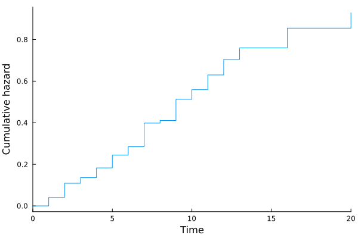
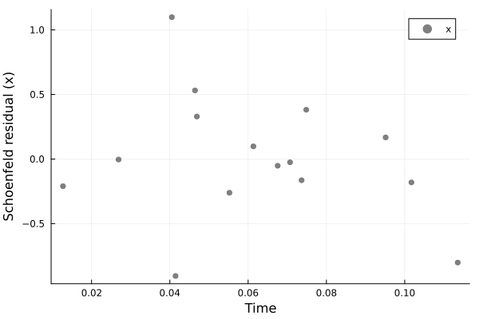
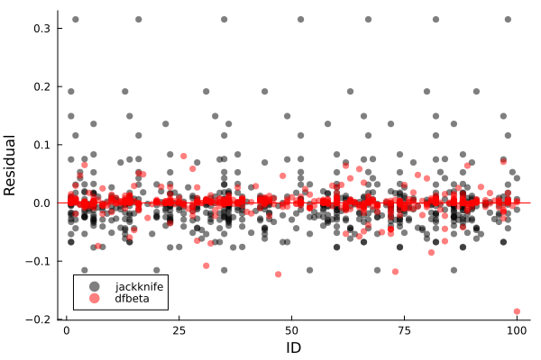
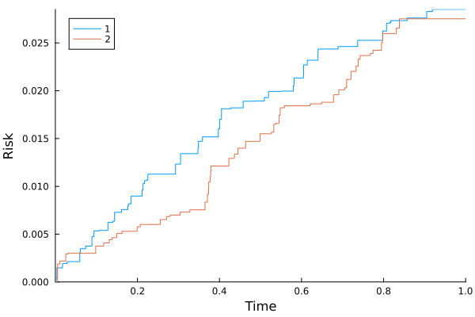
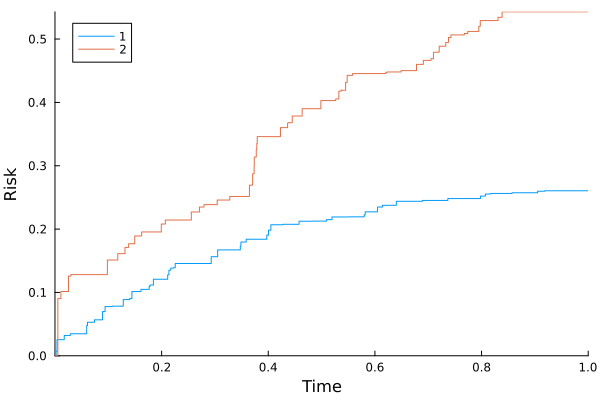

# Cox models

```julia
cd("docs/src/fig/")
using Random, LSurvival, Distributions, LinearAlgebra, Plots, DataFrames

# generate some data under a discrete hazards model
 id, int, out, data = LSurvival.dgm(MersenneTwister(1212), 100, 20)

data[:, 1] = round.(data[:, 1], digits = 3)
d, X = data[:, 4], data[:, 1:3]
wt = ones(length(d)) # random weights just to demonstrate usage


# Fit a Cox model with `Tables.jl` and `StatsAPI.@formula` interface (similar to GLM.jl)
tab = (id=id, in = int, out = out, d=d, x=X[:,1], z1=X[:,2], z2=X[:,3]) # can also be a DataFrame from DataFrames.jl
df = DataFrame("id" => id, "x"=>X[:,1],"z"=>X[:,2],"t"=>out,"enter"=>int,"d"=>d,"wt"=>wt)
show(df)
```

Note here that covariates are not time-varying, but that person-period data structures are used (which could accomdate time-varying exposures). 
```output
634×7 DataFrame
 Row │ id     x        z        t      enter  d        wt      
     │ Int64  Float64  Float64  Int64  Int64  Float64  Float64 
─────┼─────────────────────────────────────────────────────────
   1 │     1    0.125      0.0      1      0      0.0      1.0
   2 │     1    0.125      0.0      2      1      0.0      1.0
   3 │     1    0.125      0.0      3      2      0.0      1.0
   4 │     1    0.125      0.0      4      3      0.0      1.0
  ⋮  │   ⋮       ⋮        ⋮       ⋮      ⋮       ⋮        ⋮
 631 │    99    0.41       0.0      1      0      1.0      1.0
 632 │   100    0.103      0.0      1      0      0.0      1.0
 633 │   100    0.103      0.0      2      1      0.0      1.0
 634 │   100    0.103      0.0      3      2      1.0      1.0
  ```

Note use of the `id` argument to specify that multiple observations come from the same individual. This is important in the case of robust-variance estimation, jackknifing, bootstrapping, and influence-based residuals like `dfbeta` residuals. It will have no impact on the default output (confirm by fitting this model with and without the statement, and also compare influence plots below)!
```julia
mfit = coxph(@formula(Surv(in, out, d)~x+z1+z2), tab, ties = "efron", wts = wt, id = ID.(tab.id))
```

Output:

```output
Maximum partial likelihood estimates (alpha=0.05):
─────────────────────────────────────────────────────────
     ln(HR)    StdErr        LCI       UCI     Z  P(>|Z|)
─────────────────────────────────────────────────────────
x   1.6289   0.385794   0.872755  2.38504   4.22   <1e-04
z1  0.16381  0.30964   -0.443074  0.770694  0.53   0.5968
z2  1.79485  0.238453   1.32749   2.26221   7.53   <1e-13
─────────────────────────────────────────────────────────
Partial log-likelihood (null): -353.135
Partial log-likelihood (fitted): -322.353
LRT p-value (X^2=61.56, df=3): 2.7234e-13
Newton-Raphson iterations: 6
```

## Plotting survival outcomes (person-period plot)
```julia
plot(mfit.R)
savefig("ppplot.svg")
```


## Estimating baseline hazards

Baseline hazards (at referent levels of covariates) are esitmated by default in coxph.
```julia
mfit.bh
basehazplot(mfit)
savefig("basehaz.svg")
```


## Model fit: Schoenfeld residuals
```julia
residuals(mfit, type="schoenfeld")
coxdx(mfit)
savefig("schoenfeld.svg")
```


## Influence: Jackknife/dfbeta residuals
These will be on the individual level
```julia
residuals(mfit, type="dfbeta")
residuals(mfit, type="jackknife")

coxinfluence(mfit, type="jackknife", par=1)
coxinfluence!(mfit, type="dfbeta", color=:red, par=1)
savefig("influence.svg")
```



## Competing event analysis: Cox-model-based estimator of the cumulative risk/survival function

```julia
using Random, LSurvival, Distributions, LinearAlgebra

# simulate some data and store in a DataFrame
using DataFrames
z, x, t, d, event, wt = LSurvival.dgm_comprisk(MersenneTwister(122), 1000)
X = hcat(x,z)
enter = t .* rand(length(d))*0.02 # create some fake entry times
df = DataFrame("x"=>x[:,1],"z"=>z[:,1],"t"=>t,"enter"=>enter,"event"=>event,"wt"=>wt)
show(df)
```

`event` can be 0 (censored) 1 (event type 1: e.g. death from lung cancer) or 2 (event type 2: e.g. death from causes other than lung cancer)

```output
1000×6 DataFrame
  Row │ x        z        t        enter       event    wt      
      │ Float64  Float64  Float64  Float64     Float64  Float64 
──────┼─────────────────────────────────────────────────────────
    1 │  2.7596   0.475    1.0     0.0168423       0.0   1.2425
    2 │  4.166    0.3008   1.0     0.00389611      0.0   0.5362
    3 │  1.1702   4.1267   1.0     0.0128694       0.0   0.4096
    4 │  2.7756   4.7509   1.0     0.0143146       0.0   0.5082
  ⋮   │    ⋮        ⋮        ⋮         ⋮          ⋮        ⋮
  997 │  4.3977   4.611    1.0     0.00917689      0.0   0.6857
  998 │  0.3136   1.8464   0.6908  0.0133034       2.0   1.118
  999 │  3.7132   3.7309   1.0     0.0106726       0.0   1.2687
 1000 │  0.9304   3.3816   1.0     0.0104032       0.0   0.4498
 ```

### Fitting cause-specific Cox models for competing event types

```julia
fit1 = coxph(@formula(Surv(enter, t, event==1)~x+z), df, wts=df.wt)
n2idx = findall(event .!= 1)
fit2 = coxph(@formula(Surv(enter, t, event==2)~x+z), df[n2idx,:], wts=df.wt[n2idx])
```

Fit, cause 1:
```output
Maximum partial likelihood estimates (alpha=0.05):
────────────────────────────────────────────────────────────
      ln(HR)    StdErr        LCI        UCI      Z  P(>|Z|)
────────────────────────────────────────────────────────────
x  -0.65619   0.123881  -0.898992  -0.413388  -5.30   <1e-06
z  -0.461087  0.11363   -0.683798  -0.238376  -4.06   <1e-04
────────────────────────────────────────────────────────────
Partial log-likelihood (null): -320.077
Partial log-likelihood (fitted): -294.521
LRT p-value (X^2=51.11, df=2): 7.9665e-12
Newton-Raphson iterations: 4

```

Fit, cause 2:
```output
Maximum partial likelihood estimates (alpha=0.05):
────────────────────────────────────────────────────────────
      ln(HR)    StdErr        LCI        UCI      Z  P(>|Z|)
────────────────────────────────────────────────────────────
x  -0.598941  0.104098  -0.802969  -0.394914  -5.75   <1e-08
z  -0.855451  0.123795  -1.09809   -0.612817  -6.91   <1e-11
────────────────────────────────────────────────────────────
Partial log-likelihood (null): -396.624
Partial log-likelihood (fitted): -348.373
LRT p-value (X^2=96.5, df=2): 0
Newton-Raphson iterations: 5

```

### Cox-model estimator: cause-specific risks at given levels of covariates

Risk at referent levels of `x` and `z` (can be very extreme if referent levels are unlikely/unobservable). E.g. 20% survival is very low, considering the kaplan-meier overall survival estimate at the end of follow-up is 88%. This illustrates that lower levels of `x` and `z` confer exceedingly high risks in this example, but the referent levels of x=0 and z=0 are not actually observed in the data. One could center these variables in the model fit or use the approach below of predicting risk at specific, non-referent values of `x` and `z`.

```julia
println("extrema: x")
extrema(x)
println("extrema: z")
extrema(z)
kaplan_meier(enter, t, d)
res_cph_ref = risk_from_coxphmodels([fit1,fit2])
show(res_cph)
```

```output
extrema: x
(0.0121, 4.997)

extrema: z
(0.0164, 4.9996)

Kaplan-Meier Survival
───────────────────────────────────────
      time  survival  # events  at risk
───────────────────────────────────────
1   0.0022  0.992806       1.0    139.0
2   0.0038  0.988703       1.0    242.0
3   0.0054  0.985504       1.0    309.0
4   0.0111  0.983793       1.0    576.0
5   0.0174  0.982688       1.0    891.0
6   0.0254  0.981701       1.0    995.0
7   0.0288  0.980713       1.0    994.0
8   0.0298  0.979726       1.0    993.0
9   0.0595  0.978738       1.0    992.0
10  0.061   0.97775        1.0    991.0
───────────────────────────────────────
...
────────────────────────────────────────
       time  survival  # events  at risk
────────────────────────────────────────
97   0.7976  0.890839       1.0    903.0
98   0.798   0.889852       1.0    902.0
99   0.8072  0.888864       1.0    901.0
100  0.815   0.887876       1.0    900.0
101  0.8174  0.886889       1.0    899.0
102  0.8309  0.885901       1.0    898.0
103  0.8386  0.884913       1.0    897.0
104  0.8572  0.883926       1.0    896.0
105  0.9051  0.882938       1.0    895.0
106  0.9189  0.881951       1.0    894.0
────────────────────────────────────────
Number of events:      107
Number of unique event times:      106

Cox-model based survival, risk, baseline cause-specific hazard
───────────────────────────────────────────────────────────────────────────────
      time  survival  event type  cause-specific hazard  risk (j=1)  risk (j=2)
───────────────────────────────────────────────────────────────────────────────
1   0.0022  0.9935           1.0             0.00652078  0.00652078   0.0
2   0.0038  0.977515         1.0             0.016221    0.0226363    0.0
3   0.0054  0.899306         2.0             0.0833902   0.0226363    0.0815151
4   0.0111  0.888263         2.0             0.0123553   0.0226363    0.0926263
5   0.0174  0.881872         1.0             0.0072212   0.0290506    0.0926263
6   0.0254  0.85758          2.0             0.0279328   0.0290506    0.117259
7   0.0288  0.854884         1.0             0.00314874  0.0317509    0.117259
8   0.0298  0.852499         2.0             0.00279277  0.0317509    0.119647
9   0.0595  0.839375         1.0             0.0155147   0.0449772    0.119647
10  0.061   0.83411          1.0             0.00629233  0.0502588    0.119647
───────────────────────────────────────────────────────────────────────────────
...
────────────────────────────────────────────────────────────────────────────────
       time  survival  event type  cause-specific hazard  risk (j=1)  risk (j=2)
────────────────────────────────────────────────────────────────────────────────
97   0.7976  0.236422         2.0             0.0373117     0.248443    0.525142
98   0.798   0.232549         1.0             0.0165204     0.252349    0.525142
99   0.8072  0.22933          1.0             0.0139379     0.25559     0.525142
100  0.815   0.229032         1.0             0.00130164    0.255889    0.525142
101  0.8174  0.228288         1.0             0.00325216    0.256634    0.525142
102  0.8309  0.223146         2.0             0.0227819     0.256634    0.530343
103  0.8386  0.214569         2.0             0.039195      0.256634    0.539089
104  0.8572  0.213547         1.0             0.00477499    0.257658    0.539089
105  0.9051  0.211093         1.0             0.0115572     0.260126    0.539089
106  0.9189  0.210286         1.0             0.00382846    0.260934    0.539089
────────────────────────────────────────────────────────────────────────────────
Number of events (j=1):       52
Number of events (j=2):       54
Number of unique event times:      106
```

You can also estimate risk at average levels of `x` and `z` (or any level). Here, the survival (94%) is higher than the marginal survival of 88%, emphasizing that predicted risk at population average levels of covariates (the approach taken with Cox models here) can be different from population average risk across all levels of covariates (Kaplan-Meier).

```julia

mnx = sum(x)/length(x)
mnz = sum(z)/length(z)
res_cph = risk_from_coxphmodels([fit1,fit2], coef_vectors=[coef(fit1), coef(fit2)], pred_profile=mean(X, dims=1))
show(res_cph)
```


```output
Cox-model based survival, risk, baseline cause-specific hazard
────────────────────────────────────────────────────────────────────────────────
      time  survival  event type  cause-specific hazard   risk (j=1)  risk (j=2)
────────────────────────────────────────────────────────────────────────────────
1   0.0022  0.999537         1.0            0.000463234  0.000463234  0.0
2   0.0038  0.998459         1.0            0.0010791    0.00154183   0.0
3   0.0054  0.996523         2.0            0.00194023   0.00154183   0.00193724
4   0.0111  0.996232         2.0            0.000292915  0.00154183   0.00222914
5   0.0174  0.995783         1.0            0.000450318  0.00199045   0.00222914
6   0.0254  0.995048         2.0            0.000738138  0.00199045   0.00296416
7   0.0288  0.994854         1.0            0.000194896  0.00218438   0.00296416
8   0.0298  0.994781         2.0            7.38009e-5   0.00218438   0.00303758
9   0.0595  0.993826         1.0            0.000960306  0.00313968   0.00303758
10  0.061   0.993439         1.0            0.000389472  0.00352674   0.00303758
────────────────────────────────────────────────────────────────────────────────
...
────────────────────────────────────────────────────────────────────────────────
       time  survival  event type  cause-specific hazard  risk (j=1)  risk (j=2)
────────────────────────────────────────────────────────────────────────────────
97   0.7976  0.948695         2.0            0.00098538    0.0252711   0.0260532
98   0.798   0.947726         1.0            0.00102253    0.0262412   0.0260532
99   0.8072  0.946909         1.0            0.000862681   0.0270588   0.0260532
100  0.815   0.946832         1.0            8.05646e-5    0.0271351   0.0260532
101  0.8174  0.946642         1.0            0.000201291   0.0273257   0.0260532
102  0.8309  0.946072         2.0            0.00060159    0.0273257   0.0266227
103  0.8386  0.945094         2.0            0.00103501    0.0273257   0.0276019
104  0.8572  0.944814         1.0            0.000295545   0.027605    0.0276019
105  0.9051  0.944139         1.0            0.000715326   0.0282808   0.0276019
106  0.9189  0.943915         1.0            0.00023696    0.0285045   0.0276019
────────────────────────────────────────────────────────────────────────────────
Number of events (j=1):       52
Number of events (j=2):       54
Number of unique event times:      106
```


```julia
plot(res_cph)
savefig("risk-multicox.svg")
```


Here is another way to get risk at the reference level of `x` and `z`, more explicitly:

```julia
res_cph_ref = risk_from_coxphmodels([fit1,fit2], coef_vectors=[coef(fit1), coef(fit2)], pred_profile=[0.0, 0.0])
```


```julia
plot(res_cph_ref)
savefig("risk-multicox2.svg")
```

