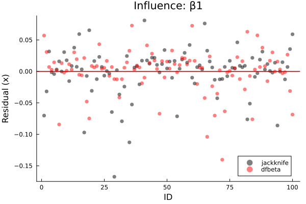

# Cox model

```julia
cd("docs/src/examples/fig/")
using Random, LSurvival, Distributions, LinearAlgebra, Plots

# generate some data under a discrete hazards model
 id, int, out, data = LSurvival.dgm(MersenneTwister(1212), 100, 20)

data[:, 1] = round.(data[:, 1], digits = 3)
d, X = data[:, 4], data[:, 1:3]
wt = rand(length(d)) # random weights just to demonstrate usage


# Fit a Cox model with `Tables.jl` and `StatsAPI.@formula` interface (similar to GLM.jl)
tab = (id=id, in = int, out = out, d=d, x=X[:,1], z1=X[:,2], z2=X[:,3]) # can also be a DataFrame from DataFrames.jl
mfit = coxph(@formula(Surv(in, out, d)~x+z1+z2), tab, ties = "efron", wts = wt, id = ID.(tab.id))
```
Output:

```output
Maximum partial likelihood estimates (alpha=0.05):
─────────────────────────────────────────────────────────
      ln(HR)    StdErr        LCI      UCI     Z  P(>|Z|)
─────────────────────────────────────────────────────────
x   1.60222   0.530118   0.563208  2.64123  3.02   0.0025
z1  0.305929  0.43838   -0.55328   1.16514  0.70   0.4853
z2  1.98011   0.325314   1.34251   2.61771  6.09   <1e-08
─────────────────────────────────────────────────────────
Partial log-likelihood (null): -150.162
Partial log-likelihood (fitted): -131.512
LRT p-value (X^2=37.3, df=3): 3.9773e-08
Newton-Raphson iterations: 5
```

## Plot survival outcomes (person-period plot)
```julia
plot(mfit.R)
savefig("ppplot.svg")
```


## Plot baseline hazard
```julia
basehazplot(mfit)
savefig("basehaz.svg")
```


## Plot Schoenfeld residuals
```julia
coxdx(mfit)
savefig("schoenfeld.svg")
```


## Plot Jackknife/dfbeta residuals to show influence
```julia
coxinfluence(mfit, type="jackknife", par=1)
coxinfluence!(mfit, type="dfbeta", color=:red, par=1)
savefig("influence.svg")
```



# Competing event analysis: Cox-model-based estimator of the cumulative risk/survival function
```julia
using Random, LSurvival, Distributions, LinearAlgebra

# simulate some data
z, x, t, d, event, wt = LSurvival.dgm_comprisk(MersenneTwister(122), 1000)
X = hcat(x,z)
enter = t .* rand(length(d))*0.02 # create some fake entry times
```


## using DataFrames with LSurvival
```
using DataFrames
df = DataFrame("x"=>x[:,1],"z"=>z[:,1],"t"=>t,"enter"=>enter,"event"=>event,"wt"=>wt)
```

## Cox-model estimator: cause-specific risks at given levels of covariates

```julia
fit1 = coxph(@formula(Surv(enter, t, event==1)~x+z), df, wts=df.wt)
n2idx = findall(event .!= 1)
fit2 = coxph(@formula(Surv(enter, t, event==2)~x+z), df[n2idx,:], wts=df.wt[n2idx])

# risk at referent levels of `x` and `z` (can be very extreme if referent levels are unlikely/unobservable)
res_cph_ref = risk_from_coxphmodels([fit1,fit2])

# risk at average levels of `x` and `z`
mnx = sum(x)/length(x)
mnz = sum(z)/length(z)
res_cph = risk_from_coxphmodels([fit1,fit2], coef_vectors=[coef(fit1), coef(fit2)], pred_profile=mean(X, dims=1))
```

```julia
plot(res_cph)
savefig("risk-multicox.svg")
```


Contrast with risk at the referent levels of x and z

```julia
res_cph_ref = risk_from_coxphmodels([fit1,fit2], coef_vectors=[coef(fit1), coef(fit2)], pred_profile=[0.0, 0.0])

plot(res_cph_ref)
savefig("risk-multicox2.svg")
```

