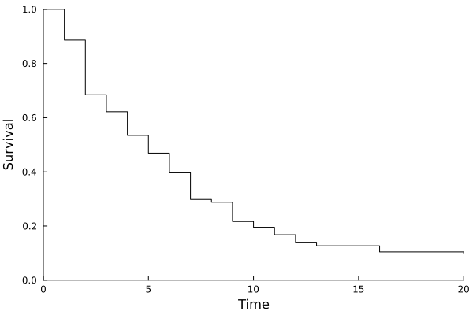
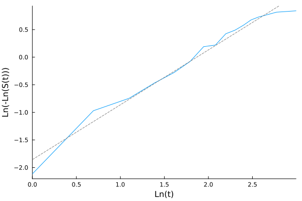
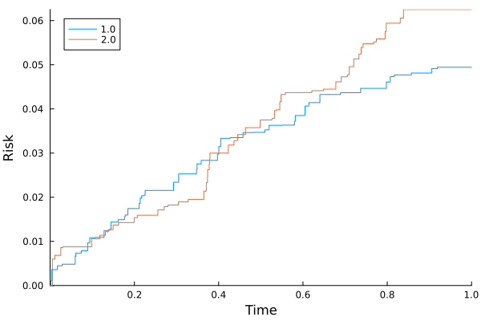

# Non-parametric survival/risk estimation with plotting

```julia
cd("docs/src/examples/fig/")
using Random, LSurvival, Distributions, LinearAlgebra, Plots

# generate some data under a discrete hazards model
id, int, out, data = LSurvival.dgm(MersenneTwister(1212), 100, 20)

data[:, 1] = round.(data[:, 1], digits = 3)
d, X = data[:, 4], data[:, 1:3]
wt = rand(MersenneTwister(1212), length(d)) # random weights just to demonstrate usage


# Kaplan-Meier curve
mfit = kaplan_meier(int, out, d, wts = wt, id = ID.(id))
```
Output:

```outputa
Kaplan-Meier Survival
────────────────────────────────────────
    time   survival   # events   at risk
────────────────────────────────────────
1    1.0  0.886358    5.73763   50.4885
2    2.0  0.684543   10.3561    45.4832
3    3.0  0.622066    3.30175   36.1763
4    4.0  0.534651    4.26077   30.3209
5    5.0  0.469165    2.652     21.6518
6    6.0  0.396423    3.57466   23.0554
7    7.0  0.298113    5.09531   20.5463
8    8.0  0.287853    0.388946  11.3009
9    9.0  0.216842    3.24547   13.156
10  10.0  0.195417    0.965415   9.77109
11  11.0  0.167813    1.43976   10.1925
12  12.0  0.140082    0.998202   6.04051
13  13.0  0.126733    0.58481    6.13692
14  16.0  0.10436     0.867046   4.91143
15  20.0  0.0986266   0.270987   4.93256
────────────────────────────────────────
Number of events:  43.7388
Number of unique event times:       15
```

## Plot survival curve
# Kaplan-Meier estimator of the cumulative risk/survival
```julia
plot(mfit)
savefig("km.svg")
```


# Checking whether marginal distribution of the outcome comports with a parametric Weibull or Exponential model
 - a straight line implies Weibull
 - a flat line implies Exponential (a special case of Weibull)
```julia
lognlogplot(mfit)
savefig("lognlog.svg")
```



# Competing event analysis: Aalen-Johansen estimator of cumulative risk
```julia
using Random, LSurvival, Distributions, LinearAlgebra

# simulate some data
z, x, t, d, event, wt = LSurvival.dgm_comprisk(MersenneTwister(122), 1000)
X = hcat(x,z)
enter = t .* rand(length(d))*0.02 # create some fake entry times

res_aj = aalen_johansen(enter, t, event; wts = wt);
res_aj
```

```output
Kaplan-Meier Survival, Aalen-Johansen risk
─────────────────────────────────────────────────────────────────────────────────────
      time  survival  # events (j=1)  # events (j=2)  at risk  risk (j=1)  risk (j=2)
─────────────────────────────────────────────────────────────────────────────────────
1   0.0022  0.998931          0.159           0.0     148.803  0.00106852  0.0
2   0.0038  0.996398          0.5814          0.0     229.219  0.00360225  0.0
3   0.0054  0.990389          0.0             1.8427  305.564  0.00360225  0.00600876
4   0.0111  0.989562          0.0             0.4837  579.421  0.00360225  0.00683553
5   0.0174  0.988695          0.781           0.0     891.278  0.00446938  0.00683553
6   0.0254  0.986939          0.0             1.7696  996.153  0.00446938  0.00859189
7   0.0288  0.986575          0.3667          0.0     994.383  0.00483333  0.00859189
8   0.0298  0.986399          0.0             0.1767  994.017  0.00483333  0.00876726
9   0.0595  0.984609          1.8042          0.0     993.84   0.00662402  0.00876726
10  0.061   0.983885          0.7293          0.0     992.036  0.00734786  0.00876726
─────────────────────────────────────────────────────────────────────────────────────
...
──────────────────────────────────────────────────────────────────────────────────────
       time  survival  # events (j=1)  # events (j=2)  at risk  risk (j=1)  risk (j=2)
──────────────────────────────────────────────────────────────────────────────────────
97   0.7976  0.895918          0.0             1.9207  904.596   0.0446602   0.0594221
98   0.798   0.894475          1.4537          0.0     902.676   0.046103    0.0594221
99   0.8072  0.893263          1.2212          0.0     901.222   0.0473151   0.0594221
100  0.815   0.89315           0.1138          0.0     900.001   0.047428    0.0594221
101  0.8174  0.892868          0.2843          0.0     899.887   0.0477102   0.0594221
102  0.8309  0.891727          0.0             1.1494  899.603   0.0477102   0.0605629
103  0.8386  0.889767          0.0             1.9746  898.453   0.0477102   0.0625227
104  0.8572  0.889355          0.4151          0.0     896.479   0.0481222   0.0625227
105  0.9051  0.888361          1.0021          0.0     896.064   0.0491168   0.0625227
106  0.9189  0.888032          0.3315          0.0     895.062   0.0494458   0.0625227
──────────────────────────────────────────────────────────────────────────────────────
Number of events (j=1.0):  46.8371
Number of events (j=2.0):  58.4336
Number of unique event times:      106
```

## Aalen-Johansen plot: marginal cause-specific risks
```julia
plot(res_aj)
savefig("aj.svg")
```


