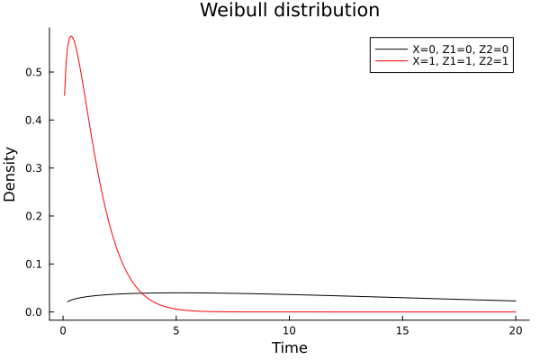
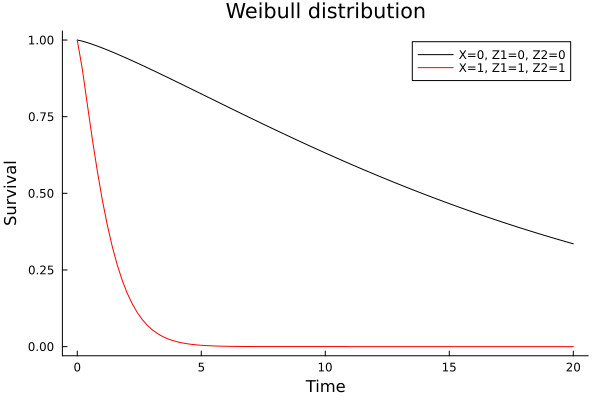
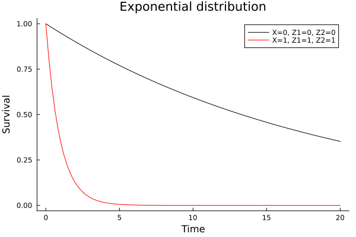
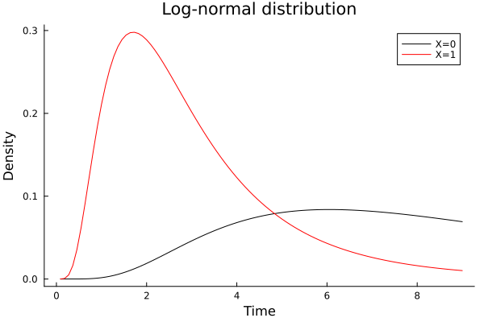

# Parametric survival/risk estimation with Weibull AFT models

## Weibull accelerated failure time model
```julia
cd("docs/src/fig/")
using Random, LSurvival, Distributions, LinearAlgebra, Plots

# generate some data under a discrete hazards model
 id, int, out, data = LSurvival.dgm(MersenneTwister(1212), 1000, 20)

data[:, 1] = round.(data[:, 1], digits = 3)
d, X = data[:, 4], data[:, 1:3]
wt = rand(MersenneTwister(1212), length(d)) # random weights just to demonstrate usage


# Fit a Cox model with `Tables.jl` and `StatsAPI.@formula` interface (similar to GLM.jl)
tab = (id=id, in = int, out = out, d=d, x=X[:,1], z1=X[:,2], z2=X[:,3], wts=wt) # can also be a DataFrame from DataFrames.jl
weibullfit = survreg(@formula(Surv(in, out, d)~x+z1+z2), tab, wts=tab.wts, dist=LSurvival.Weibull())
```

Output:

```output
Maximum likelihood estimates (alpha=0.05):
────────────────────────────────────────────────────────────────────────
                   Est     StdErr        LCI        UCI       Z  P(>|Z|)
────────────────────────────────────────────────────────────────────────
(Intercept)   2.92482   0.0808023   2.76645    3.08319    36.20   <1e-99
x            -1.50998   0.135432   -1.77543   -1.24454   -11.15   <1e-99
z1           -0.072211  0.106681   -0.281301   0.136879   -0.68   0.4985
z2           -1.08864   0.0906976  -1.2664    -0.910874  -12.00   <1e-99
log(Scale)   -0.223338  0.0368294  -0.295522  -0.151153   -6.06   <1e-08
────────────────────────────────────────────────────────────────────────
Weibull distribution
Log-likelihood (full): -1222.58
Log-likelihood (Intercept only):  -1356.2
LRT p-value (X^2=267.23, df=3): 0
Solver iterations: 15
```

## Comparing Weibull AFT and Cox model results

For the Weibull distribution, AFT model and Cox model results can be compared directly by converting AFT estimates to hazard ratios

```julia
coxfit = coxph(@formula(Surv(in, out, d)~x+z1+z2), tab, ties = "efron", wts = wt, id = ID.(tab.id))
```

Output:

```output
Maximum partial likelihood estimates (alpha=0.05):
───────────────────────────────────────────────────────────
      ln(HR)    StdErr        LCI       UCI      Z  P(>|Z|)
───────────────────────────────────────────────────────────
x   1.78123   0.181734   1.42504   2.13742    9.80   <1e-99
z1  0.109247  0.133533  -0.152473  0.370968   0.82   0.4133
z2  1.59741   0.10216    1.39718   1.79764   15.64   <1e-99
───────────────────────────────────────────────────────────
Partial log-likelihood (null): -2460.82
Partial log-likelihood (fitted): -2314.18
LRT p-value (X^2=293.28, df=3): 0
Newton-Raphson iterations: 6
```

Convert the AFT model parameters to hazard ratios to compare (note that this conversion is not possible for all parametric survival distributions).

```julia
scale = exp(weibullfit.P._S[1])
aftparms = coef(weibullfit)[2:end]
parmhrs = - aftparms ./ scale
hcat(coef(coxfit), parmhrs)
```

Output:
The first column is ln(HR) estimate from a Cox model, and the second is from the Weibull model

```output
3×2 Matrix{Float64}:
 1.78123   1.88785
 0.109247  0.0902812
 1.59741   1.36106
```

## Visualizing the distributions, probability density
```julia
using Plots

aftdist(weibullfit, label="X=0, Z1=0, Z2=0", title="Weibull distribution")
# for specific covariate levels, include a 1.0 for the intercept
aftdist!(weibullfit, covlevels=[1.0, 1.0, 1.0, 1.0], color="red", label="X=1, Z1=1, Z2=1", npoints=300)
savefig("survdist_pdf.svg")
```



## Visualizing the distributions, survival distribution
```julia
using Plots

aftdist(weibullfit, type="surv", label="X=0, Z1=0, Z2=0", title="Weibull distribution")
# for specific covariate levels, include a 1.0 for the intercept
aftdist!(weibullfit, type="surv", covlevels=[1.0, 1.0, 1.0, 1.0], color="red", label="X=1, Z1=1, Z2=1")
savefig("survdist_surv.svg")
```


## Other distributions


### Exponential
Note that the exponential fit looks a lot like the Weibull fit. The log-scale parameter in the Weibull fit is close to zero. When it is exactly zero, then the Weibull distribution and exponential distribution are identical.

```julia
expfit = survreg(@formula(Surv(in, out, d)~x+z1+z2), tab, wts=tab.wts, dist=LSurvival.Exponential())
aftdist(expfit, type="surv", label="X=0, Z1=0, Z2=0", title="Exponential distribution")
# for specific covariate levels, include a 1.0 for the intercept
aftdist!(expfit, type="surv", covlevels=[1.0, 1.0, 1.0, 1.0], color="red", label="X=1, Z1=1, Z2=1")
savefig("exponential.svg")
```


Output:

```output
Maximum likelihood estimates (alpha=0.05):
──────────────────────────────────────────────────────────────────────
                   Est    StdErr        LCI       UCI       Z  P(>|Z|)
──────────────────────────────────────────────────────────────────────
(Intercept)   2.95353   0.100392   2.75677    3.15029   29.42   <1e-99
x            -1.55072   0.16808   -1.88015   -1.22129   -9.23   <1e-99
z1           -0.082459  0.133349  -0.343818   0.1789    -0.62   0.5363
z2           -1.36337   0.101441  -1.5622    -1.16455  -13.44   <1e-99
──────────────────────────────────────────────────────────────────────
Exponential distribution
Log-likelihood (full): -1239.09
Log-likelihood (Intercept only):  -1359.4
LRT p-value (X^2=240.61, df=3): 0
Solver iterations: 14
```


### Log-normal

```julia
# note this model runs into convergence issues in these data
    #lognormalfit = survreg(@formula(Surv(in, out, d)~x+z1+z2), tab, wts=tab.wts, dist=LSurvival.Lognormal())

# Here are results from a simpler model
dat1 = (time = [1, 1, 6, 6, 8, 9], status = [1, 0, 1, 1, 0, 1], x = [1, 1, 1, 0, 0, 0])
lognormalfit = survreg(@formula(Surv( time, status)~x), dat1, dist=LSurvival.Lognormal())
aftdist(lognormalfit, label="X=0", title="Log-normal distribution")
aftdist!(lognormalfit, covlevels=[1.0], color="red", label="X=1")
savefig("lognormal_pdf.svg")
```


```output
Maximum likelihood estimates (alpha=0.05):
─────────────────────────────────────────────────────────────────────
                   Est    StdErr       LCI        UCI      Z  P(>|Z|)
─────────────────────────────────────────────────────────────────────
(Intercept)   2.20995   0.40358    1.41895   3.00095    5.48   <1e-07
x            -1.26752   0.585011  -2.41412  -0.120918  -2.17   0.0303
log(Scale)   -0.445615  0.342319  -1.11655   0.225318  -1.30   0.1930
─────────────────────────────────────────────────────────────────────
Lognormal distribution
Log-likelihood (full): -10.4662
Log-likelihood (Intercept only): -12.9106
LRT p-value (X^2=4.89, df=2): 0.086774
Solver iterations: 9
```


### Gamma
```julia
gammafit = survreg(@formula(Surv(in, out, d)~x+z1+z2), tab, wts=tab.wts, dist=LSurvival.Gamma())
aftdist(gammafit, type="surv", label="X=0, Z1=0, Z2=0", title="Gamma distribution")
# for specific covariate levels, include a 1.0 for the intercept
aftdist!(gammafit, type="surv", covlevels=[1.0, 1.0, 1.0, 1.0], color="red", label="X=1, Z1=1, Z2=1")
savefig("gamma.svg")
```


```output
Maximum likelihood estimates (alpha=0.05):
─────────────────────────────────────────────────────────────────────────
                    Est     StdErr        LCI        UCI       Z  P(>|Z|)
─────────────────────────────────────────────────────────────────────────
(Intercept)   2.43748    0.0743159   2.29182    2.58313    32.80   <1e-99
x            -1.49903    0.134053   -1.76176   -1.23629   -11.18   <1e-99
z1           -0.0770725  0.137475   -0.346519   0.192374   -0.56   0.5751
z2           -1.12406    0.0256118  -1.17425   -1.07386   -43.89   <1e-99
κ             0.410826   0.0436605   0.325253   0.496399    9.41   <1e-99
─────────────────────────────────────────────────────────────────────────
Gamma distribution
Log-likelihood (full): -1219.09
Log-likelihood (Intercept only): -1352.33
LRT p-value (X^2=266.48, df=3): 0
Solver iterations: 21
```

Notes: analytic gradients and Hessian matrixes are not available for this distribution, so the solver uses finite differencing, which can make this model considerably slower to fit than alternative models.


### Generalized gamma
```julia
ggammafit = survreg(@formula(Surv(in, out, d)~x+z1+z2), tab, wts=tab.wts, dist=LSurvival.GGamma())
#ggammafit = survreg(@formula(Surv(in, out, d)~x+z1+z2), tab, wts=tab.wts, dist=LSurvival.GGamma(), verbose=true) #see convergence issue
ggammafit2 = survreg(@formula(Surv(in, out, d)~x+z1+z2), tab, wts=tab.wts, dist=LSurvival.GGamma(), start=zeros(6))
#simpler fit
    rng = MersenneTwister(121)
    n = 1000
    x = rand(rng, [0,1], n)
    wtab = (
      t = [LSurvival.randweibull(rng, exp(1), exp((1-x[i]))) for i in 1:n],
      d = rand(rng, [0,1], n),
      x = x
    )

ggammafit2 = survreg(@formula(Surv(t, d)~x), wtab, dist=LSurvival.GGamma())
aftdist(ggammafit2, label="X=0", title="Generalized gamma distribution")
aftdist!(ggammafit2, covlevels=[1.0], color="red", label="X=1")
savefig("gengamma_pdf.svg")
```


```output
┌ Warning: Optimizer reports model did not converge. Gradient: [-0.30185255746883194, -92.76305273476676, -12.51874622578631]
└ @ LSurvival ~/.julia/packages/LSurvival/LckPM/src/parsurvival.jl:454

Maximum likelihood estimates (alpha=0.05):
─────────────────────────────────────────────────────────────────────────
                    Est     StdErr        LCI        UCI       Z  P(>|Z|)
─────────────────────────────────────────────────────────────────────────
(Intercept)   1.63286    0.315163    1.01516    2.25057     5.18   <1e-06
x            -1.48364    0.0659245  -1.61285   -1.35443   -22.51   <1e-99
z1           -0.0823059  0.250621   -0.573515   0.408903   -0.33   0.7426
z2           -1.17402    0.144571   -1.45737   -0.890661   -8.12   <1e-15
log(scale)    0.268056   0.0312804   0.206748   0.329365    8.57   <1e-99
κ             0.872033   0.20311     0.473946   1.27012     4.29   <1e-04
─────────────────────────────────────────────────────────────────────────
GGamma distribution
Log-likelihood (full): -1217.97
Log-likelihood (Intercept only): -1327.99
LRT p-value (X^2=220.05, df=3): 0
Solver iterations: 41

# fit 2: note stderr column
Maximum likelihood estimates (alpha=0.05):
────────────────────────────────────────────────────────────────────────
                    Est    StdErr        LCI        UCI       Z  P(>|Z|)
────────────────────────────────────────────────────────────────────────
(Intercept)   1.63286    0.705252   0.250596   3.01513     2.32   0.0206
x            -1.48364    0.145726  -1.76926   -1.19803   -10.18   <1e-99
z1           -0.0823059  0.114052  -0.305845   0.141233   -0.72   0.4705
z2           -1.17402    0.102888  -1.37567   -0.972358  -11.41   <1e-99
log(scale)    0.268056   0.189051  -0.102477   0.638589    1.42   0.1562
κ             0.872033   0.334477   0.216471   1.5276      2.61   0.0091
────────────────────────────────────────────────────────────────────────
GGamma distribution
Log-likelihood (full): -1217.97
Log-likelihood (Intercept only): -1327.99
LRT p-value (X^2=220.05, df=3): 0
Solver iterations: 46

# fit 3: simpler data (no convergence issues)
Maximum likelihood estimates (alpha=0.05):
──────────────────────────────────────────────────────────────────────────
                   Est      StdErr        LCI        UCI        Z  P(>|Z|)
──────────────────────────────────────────────────────────────────────────
(Intercept)   1.4276    0.00738963   1.41311    1.44208    193.19   <1e-99
x            -0.981762  0.0278233   -1.03629   -0.927229   -35.29   <1e-99
log(scale)   -1.35909   0.0099205   -1.37853   -1.33965   -137.00   <1e-99
κ            -0.481034  0.0338139   -0.547308  -0.41476    -14.23   <1e-99
──────────────────────────────────────────────────────────────────────────
GGamma distribution
Log-likelihood (full): -745.685
Log-likelihood (Intercept only): -963.049
LRT p-value (X^2=434.73, df=1): 0
Solver iterations: 66
```

Notes: analytic gradients and Hessian matrixes are not available for this distribution, so the solver uses finite differencing, which can make this model considerably slower to fit than alternative models.

### Log-logistic
In progress

### Gompertz
In progress